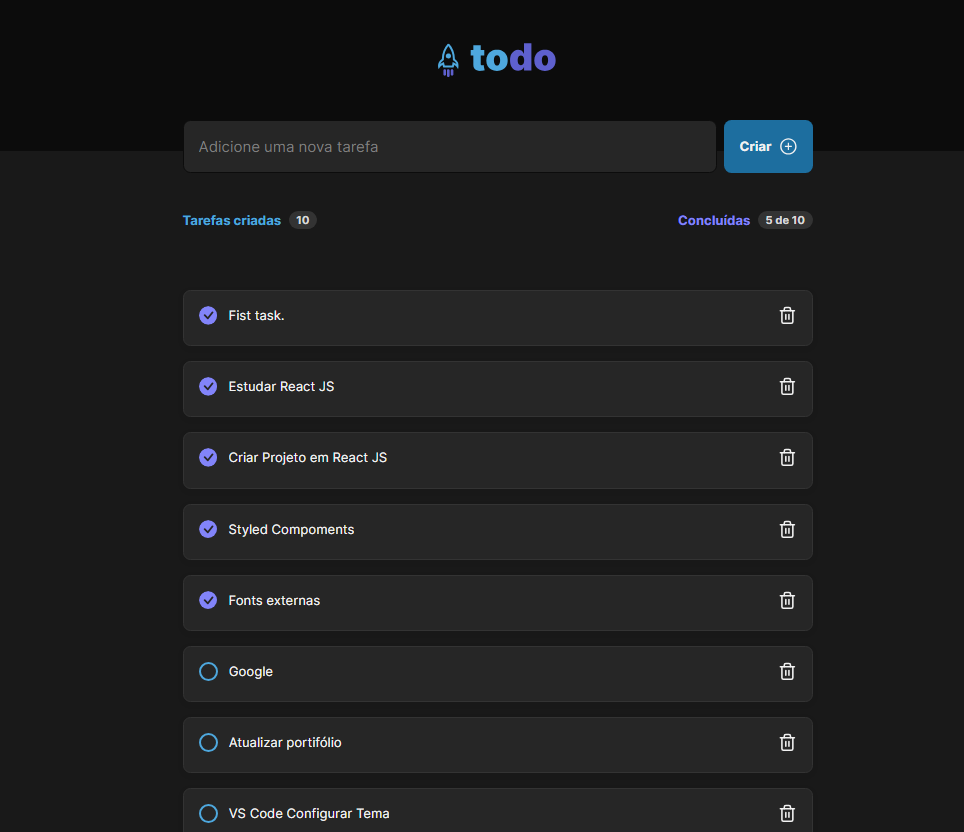

# Primeiro desafio da trilha de React JS do Ignite

> Projeto - https://todo-list-ignite-tau.vercel.app/

## Trail Ignite

> Primeiro desafio do courso Ignite da Rocketseat :rocket:. Consiste em construir uma ToDo List em react js utilisando styled components para estilizar e react JS com muitas funcionalidades como criar novas tarefas, marcar as tarefas como concluidas e deletar qualquer tarefa.

## :hammer_and_wrench: Technologies

- JavaScript
- React JS
- Styled Components
- Programação declarativa 

## :mailbox_closed: Contacts

> Email - rosendc30@gmail.com

> Linkedin - https://www.linkedin.com/in/francisco-rosendo-a05623241/
